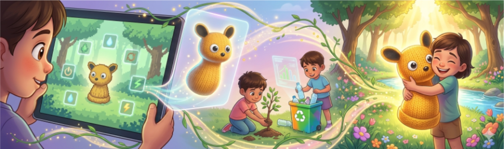
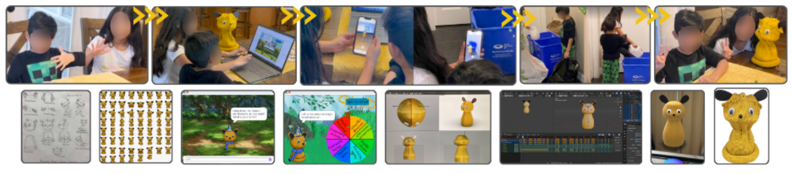
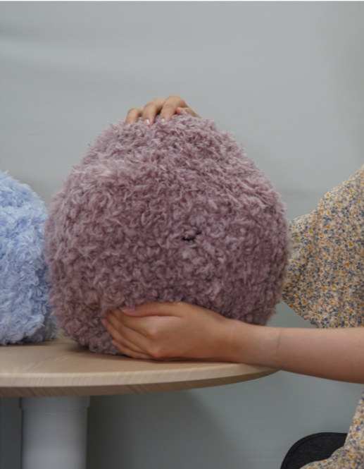
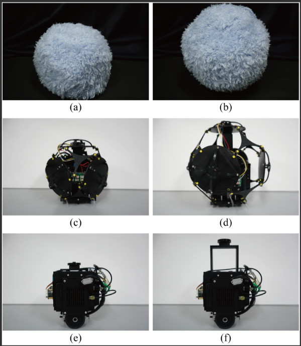
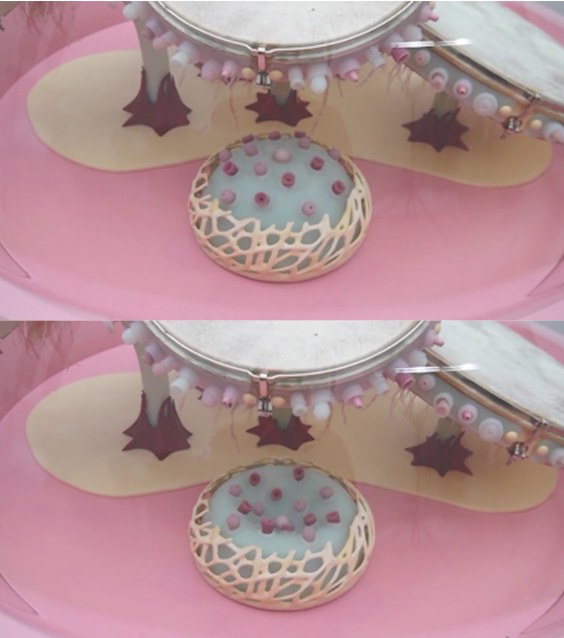
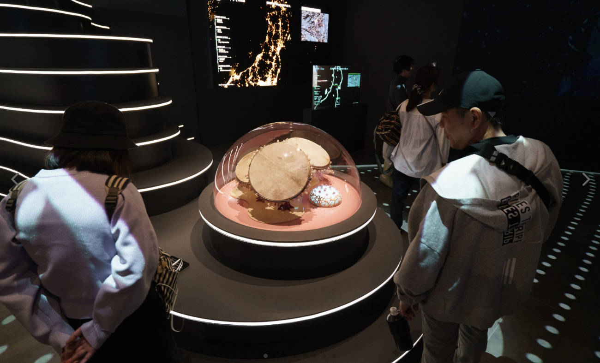
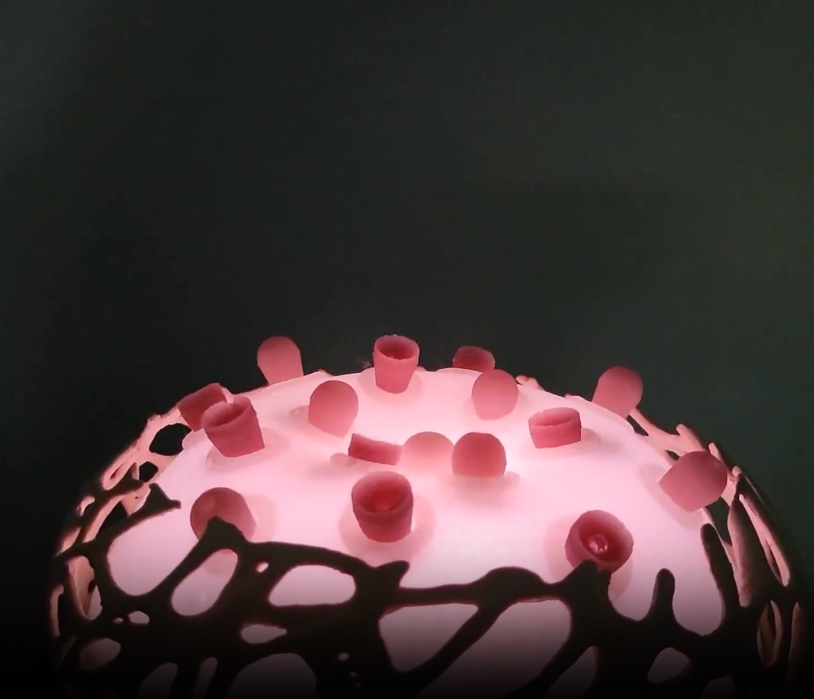

# Entrega 01 — Marco del problema

**Fecha:** 03-09-2026  
**Estudiante:** Valentina Garrido

## Fenómeno

Fenómenos ambientales imperceptibles

Diversas condiciones ambientales se encuentran en constante transformación, pero muchas de sus variaciones no son directamente perceptibles a través de nuestros sentidos. Fenómenos relacionados con la calidad del aire, la humedad, la radiación u otras condiciones del entorno suelen hacerse visibles principalmente mediante instrumentos de medición y posteriormente representarse a través de cifras, gráficos o indicadores.

Esta situación genera una distancia entre los fenómenos que ocurren en nuestro entorno y nuestra capacidad de percibirlos directamente.

Tensión: ¿Cómo hacer perceptible y comprensible un fenómeno ambiental que no podemos observar directamente?
## Contexto / usuario

El proyecto se sitúa en un **contexto educativo**, dirigido inicialmente a niños y niñas de **3.º a 6.º básico**. Durante estos niveles, la asignatura de Ciencias Naturales incorpora progresivamente la observación, medición y comprensión del entorno, junto con contenidos relacionados con el medioambiente y su cuidado.

[Currículum Nacional — Ciencias Naturales 4.º básico](https://www.curriculumnacional.cl/curriculum/1o-6o-basico/ciencias-naturales/4-basico)

En la educación ambiental, muchos fenómenos y condiciones del entorno se explican a través de conceptos, datos y representaciones. Sin embargo, no siempre es posible observar directamente lo que está ocurriendo en el ambiente.

En este contexto aparece la oportunidad de explorar formas de aprendizaje que acerquen estos fenómenos a una experiencia más perceptible, favoreciendo su observación, interpretación y comprensión.

Desde una aproximación cercana a la **ciencia ciudadana**, resulta relevante acercar la observación y el conocimiento ambiental a personas no especializadas. La medición del entorno puede ser entendida no solo como una forma de obtener datos, sino también como una herramienta para conocer, interpretar y generar mayor conciencia sobre el ambiente que habitamos.

La **sala de clases** se plantea inicialmente como espacio de exploración, vinculando aprendizaje ambiental y observación del entorno.

## Referentes

### Referente 01

**Guardians of the Planet: A Multi-Realm Robot Bridging Learning and Real-World Sustainability for Children (2026)**

Es un proyecto educativo que utiliza a **Blossom**, un mismo personaje que acompaña a los niños a través de un videojuego 2D, una experiencia de realidad aumentada y finalmente un robot físico. La experiencia conecta el aprendizaje sobre sustentabilidad con **acciones cotidianas de cuidado ambiental, como el ahorro de agua y energía o el manejo responsable de residuos**. A lo largo de ella, Blossom cambia de estado, debilitándose o recuperando energía según lo que ocurre en la experiencia.

**Relevancia para el proyecto**

Se rescata el uso de una **entidad artificial como mediadora del aprendizaje ambiental**, capaz de acercar estos contenidos a los niños mediante una experiencia física e interactiva.

[Ver publicación — Guardians of the Planet / Blossom](https://doi.org/10.1145/3773077.3815130)

### Referente 02
**MOFU: Development of a MOrphing Fluffy Unit with Expansion and Contraction Capabilities and Evaluation of the Animacy of Its Movements**

MOFU es un robot móvil de forma abstracta y superficie peluda, diseñado para explorar cómo el movimiento puede generar una **percepción de vida en un objeto artificial**. Su cuerpo puede expandirse y contraerse, modificando su volumen completo, además de desplazarse y rotar.

El proyecto estudia específicamente cómo estos cambios corporales influyen en la percepción de *animacy*, es decir, en qué medida un objeto es percibido como si tuviera cualidades propias de un ser vivo.

**Relevancia para el proyecto**

Se rescata la capacidad de **comunicar mediante la transformación y el comportamiento del cuerpo**, sin depender únicamente de pantallas, gráficos o números. Esto permite pensar el organismo artificial como una entidad capaz de **encarnar una condición ambiental mediante cambios físicos perceptibles**. 

[Ver publicación — MOFU](https://journals.plos.org/plosone/article?id=10.1371/journal.pone.0354179)

**pneumOS — The Knowledge of the Air is Open Source**

*pneumOS* es una **instalación interactiva creada por Oriana Persico**, definida como un **órgano cibernético que respira con la ciudad** y busca sensibilizar a sus habitantes sobre el bienestar del aire.

La instalación es animada por datos de calidad del aire de Rávena. Está compuesta por **cinco membranas sonoras y una bolsa de respiración**, que transforman los datos provenientes de estaciones de monitoreo en movimiento y sonido. A partir de estos datos se genera una **“gramática de la respiración”**: cuando el aire se acerca a los estándares establecidos, la respiración es pausada y el sonido más limpio; a medida que aumenta la contaminación, la respiración se acelera y el sonido se vuelve más ruidoso.

De esta manera, la información sobre la calidad del aire deja de presentarse únicamente como un dato técnico y se convierte en una **experiencia perceptible**, donde las personas pueden aprender a interpretar el estado del aire observando el comportamiento expresivo del órgano.

**Relevancia para el proyecto**

Se rescata la manera en que un **fenómeno ambiental invisible se encarna en el comportamiento de un organismo artificial**, utilizando la respiración, el movimiento y el sonido para hacer perceptible la calidad del aire. Además, transforma datos técnicos en una **experiencia sensorial y expresiva**, mostrando cómo este tipo de interacción puede favorecer el aprendizaje y la sensibilización sobre el ambiente.

[Ver proyecto — pneumOS](https://www.he-r.it/project/pneumos/)

## Variable

Se propone trabajar con el aire como medio de exploración, ya que muchas de sus condiciones pueden cambiar sin que estas variaciones sean evidentes a simple vista. A diferencia de fenómenos como la temperatura, cuyos cambios podemos percibir corporalmente con mayor facilidad, ciertas características del aire requieren de instrumentos para ser detectadas y comprendidas.

Esto permite abordar una de las ideas centrales del proyecto: hacer perceptible aquello que está presente en nuestro entorno, pero que no necesariamente podemos observar directamente.

Dentro de este marco, se seleccionan inicialmente dos variables: material particulado fino (PM2.5) y concentración de dióxido de carbono (CO₂).

PM2.5: corresponde a partículas finas suspendidas en el aire. Su medición permite evidenciar la presencia y variación de material particulado que no siempre es posible identificar directamente.

CO₂: su concentración en espacios interiores permite observar cómo cambian las condiciones del aire según factores como la ocupación y la ventilación.

La medición de ambas variables permitiría explorar dos condiciones diferentes del aire y posteriormente investigar cómo sus cambios pueden ser traducidos a una experiencia perceptible.
## Primera hipótesis de dispositivo

Se propone desarrollar un **organismo artificial interactivo capaz de percibir condiciones del aire y traducir sus variaciones mediante cambios en su comportamiento corporal**.

La elección de un organismo artificial busca que la información ambiental no sea percibida únicamente como un indicador. A través del movimiento, la transformación y otros comportamientos expresivos, se busca generar una **percepción de vitalidad** y acercar al usuario/a al fenómeno ambiental desde una experiencia más física y perceptible.

El organismo recibiría información del ambiente mediante sensores. Como primera aproximación, se propone explorar un **PMS5003** para medir material particulado (PM2.5) y un **MH-Z19B** para medir concentración de CO₂. Estas mediciones funcionarían como estímulos capaces de modificar el estado del organismo.

Para generar estas respuestas, se explorarán distintos **sistemas de actuación capaces de producir cambios corporales**, incluyendo mecanismos neumáticos para expansión y contracción, servomotores o sistemas de tracción para modificar su postura y movimiento, y recursos lumínicos integrados mediante LEDs. Estos recursos permitirían explorar la construcción de un **lenguaje corporal**, donde las variaciones del aire puedan expresarse mediante cambios de **volumen, ritmo, postura, movimiento e iluminación**. Se considera además el uso de **materiales translúcidos o transparentes**, permitiendo que la iluminación interior forme parte de sus estados expresivos.

El dispositivo estaría dirigido inicialmente a niños y niñas de **3.º a 6.º básico**, funcionando como una herramienta de exploración y aprendizaje ambiental a través de la observación de sus diferentes estados.

### Primera relación de funcionamiento

**Condición del aire → sensor → procesamiento → actuación → comportamiento del organismo → interpretación**
